# Faktura – brugervejledning

Denne vejledning er til dig, der driver en lille virksomhed og skal sende fakturaer, holde styr på bilag og
indberette moms fire gange om året. Du behøver ikke at være bogholder eller udvikler. Skærmbillederne er fra
programmet med testdata.

Indhold: 1. Kom i gang · 2. Fakturaer · 3. Udgifter · 4. Moms · 5. Månedsrutinen · 6. Budget og overblik ·
7. AI-adgang (MCP) · 8. Eksport og revisor

---

## 1. Kom i gang

**Første login.** Åbn adressen, som installationen viste (typisk `http://localhost:3000`), og log ind med det
kodeord, du valgte. I skærmbilledet hedder programmet **Kvit** (af *kvit og frit*); Faktura er projektets navn, og de to
bruges om det samme. Der er ét kodeord og én bruger: programmet er dit bogholderi, ikke en tjeneste med konti.

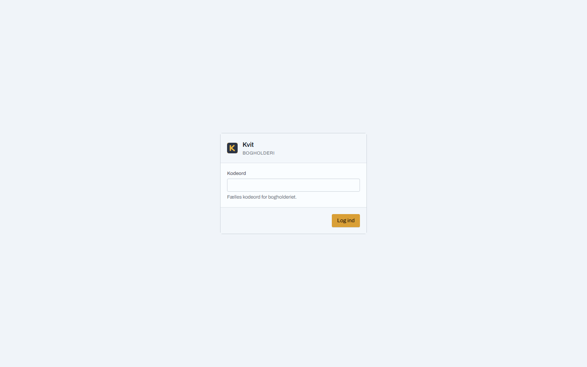

**Firmaoplysninger.** Gå til **Indstillinger** og udfyld firmanavn, adresse, CVR-nummer og bankoplysninger
(reg.- og kontonummer). Felterne er lovpligtige på en faktura, og programmet nægter at udstede, før de er udfyldt.
Betalingsfristen (standard 14 dage) bruges til at foreslå forfaldsdato; den kan sættes pr. kunde.

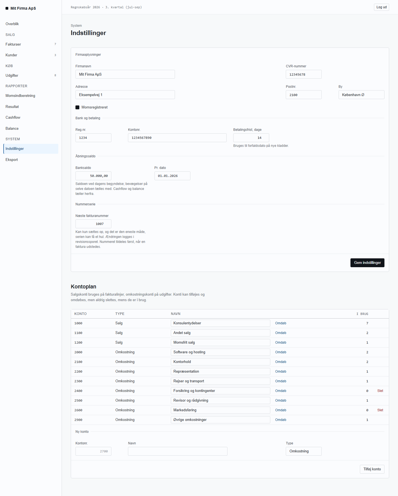

**Kontoplan.** Under Indstillinger ligger en lille, flad kontoplan: salgskonti (1000 Konsulentydelser, 1100 Andet
salg, 1200 Momsfrit salg) og omkostningskonti (2000 Software og hosting … 2900 Øvrige omkostninger). Hver
fakturalinje og hver udgift bogføres på én konto. Du kan tilføje konti, omdøbe dem, give dem en gruppe og arkivere
dem (så de ikke tilbydes til nye bilag, men historikken bliver stående). En konto, der er i brug, kan ikke slettes –
ellers ville gamle bilag pege på noget, der ikke findes – og nummer og type kan ikke ændres. Sætter du grupper på
konti, får Resultat en mellemsum pr. gruppe, i rækkefølge efter laveste kontonummer; uden grupper ser det ud som før.

Kontoplanen kan også rettes i et regneark: *Hent kontoplan.csv* under Indstillinger giver kolonnerne
`kontonr;navn;type;gruppe;arkiveret`. Ret navne, grupper og status (ja/nej), tilføj rækker med nye numre, og indlæs
filen igen. Kontonummeret er nøglen, type kan ikke ændres, og indlæsningen sker samlet – er der én fejl, ændres intet.
Konti, der mangler i filen, beholdes, medmindre du sætter kryds ved *Slet dem*; konti med bilag kan aldrig slettes den
vej, kun arkiveres. Vil du have mere end de elleve konti, ligger der et forslag til en udvidet, grupperet kontoplan
(direkte omkostninger, personale, finansielle poster) som download samme sted – hent, ret og indlæs.

**Åbningssaldo.** Indtast den saldo, din bankkonto havde ved dagens begyndelse på den dato, du starter bogføringen.
Alle bevægelser fra og med den dato tælles med, og cashflow og balance regner videre fra tallet. Uden en korrekt
åbningssaldo passer bankpositionen aldrig.

---

## 2. Fakturaer

**Kladde.** Vælg kunde på **Fakturaer** og tryk *Ny faktura*. Kladden har intet nummer og kan rettes og slettes frit.
Du udfylder fakturadato, forfaldsdato (følger kundens betalingsfrist, men kan rettes), fakturalinjer med antal, enhed
og pris ekskl. moms og eventuelt en betalingsreference – den tekst kunden skriver på bankoverførslen. Tom reference
bliver til »Faktura <nummer>« ved udstedelse. Under kladden kan du vedhæfte PDF-bilag (fx en timeopgørelse), som
samles bag fakturaen i ét dokument, og se et udkast som PDF, før du udsteder.

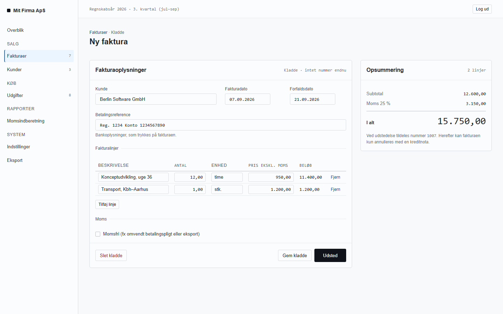

**Udsted.** Knappen *Udsted* er den vigtigste i programmet. Den beder om bekræftelse og fortæller, hvilket nummer
fakturaen får. I samme øjeblik tildeles nummeret, PDF'en genereres og gemmes som det juridiske dokument, og fakturaen
låses.

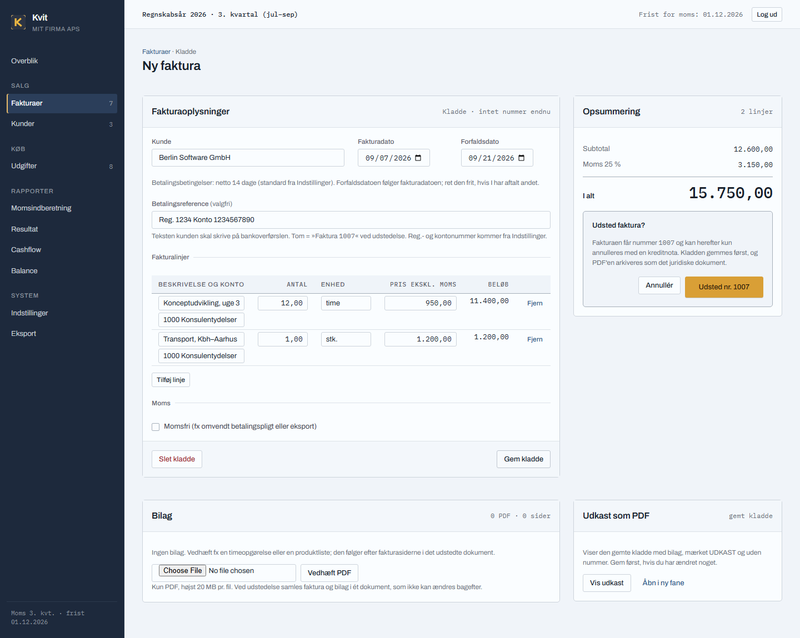

**Hvorfor kan udstedte fakturaer ikke rettes?** Bogføringsloven kræver en ubrudt nummerserie og dokumenter, der ikke
ændres efter afsendelse. Faktura håndhæver det hårdt: numre tildeles kun ved udstedelse (kladder har ingen), og en
udstedt faktura kan ikke redigeres eller slettes af nogen – heller ikke af en AI eller et databaseværktøj. Så er der
aldrig huller i serien, og revisor kan følge hver krone til en gemt PDF.

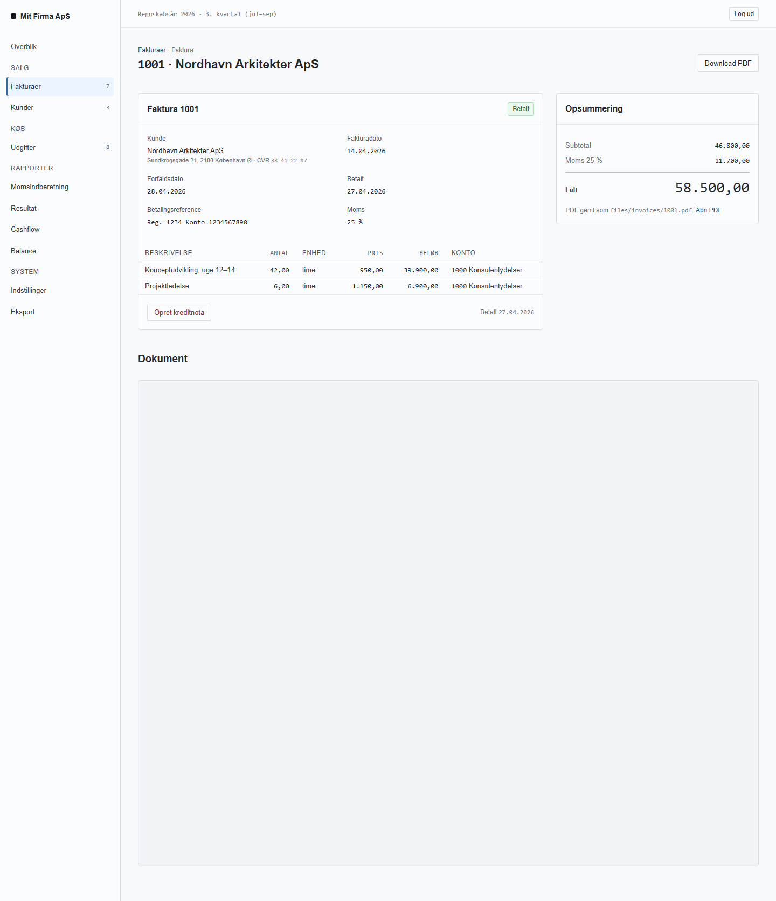

**Kreditnota – rettelsen.** Er der fejl i en udstedt faktura, opretter du en kreditnota fra fakturasiden. Den
modposterer alle linjer, får det næste nummer i serien og henviser til den oprindelige faktura, som markeres
*Krediteret*. Herefter laver du en ny, korrekt faktura. Begge dokumenter bliver stående.

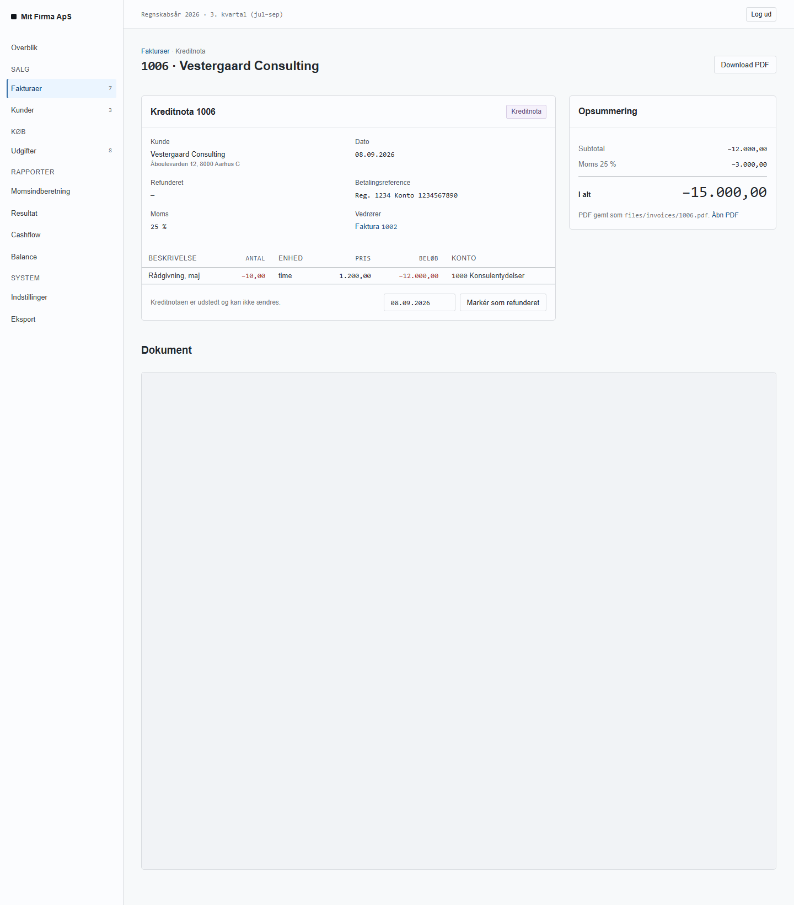

**Markér som betalt.** Når pengene er på kontoen, registrerer du betalingsdatoen på fakturaen. Det er den dato, der
styrer cashflow og bankposition. En kreditnota til en allerede betalt faktura markeres tilsvarende som *refunderet*,
når pengene er sendt tilbage.

**Markér som sendt.** Udstedte dokumenter, der ikke er markeret som sendt til kunden, får en tydelig advarsel på
Overblik og i listen. Send PDF'en, og markér den sendt med dato.

---

## 3. Udgifter

**Bilagsnummer.** Hver udgift får automatisk det næste bilagsnummer (1, 2, 3 …) ved oprettelse. Skriv nummeret på
det fysiske bilag eller i filnavnet, så revisor kan finde det. Nummeret kan ikke vælges eller genbruges.

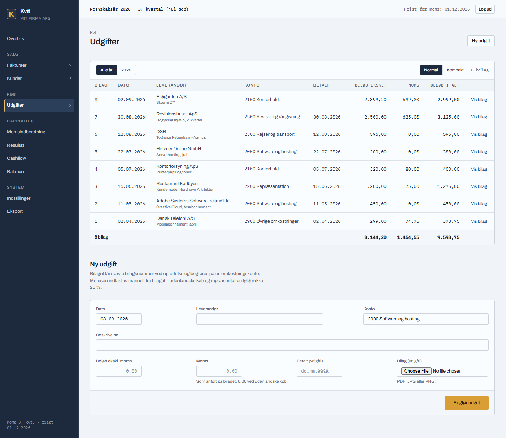

**Upload.** Vedhæft bilaget (PDF, JPG eller PNG) direkte på udgiften. Filen gemmes som
`files/expenses/<bilagsnummer>.<type>` i datamappen og vises på udgiftens side.

**Leverandører.** Leverandøren vælges i en liste; vælg *+ Ny leverandør* og skriv navnet, så oprettes den med et id
og står i listen næste gang. Samme navn (uanset store og små bogstaver) bliver aldrig til to leverandører. Under
**Udgiftsrapport** kan du omdøbe en leverandør – alle dens bilag følger med – og slette en, der ingen bilag har.

**Udgiftsrapport.** Under *Rapporter → Udgiftsrapport* ser du, hvad der er købt, hos hvem og hvornår: udgifter ekskl.
moms pr. omkostningskonto måned for måned, med leverandørerne under hver konto (størst først), og en tabel pr.
leverandør med de konti, den er bogført på. Vælg år og eventuelt kvartal som på Resultat.

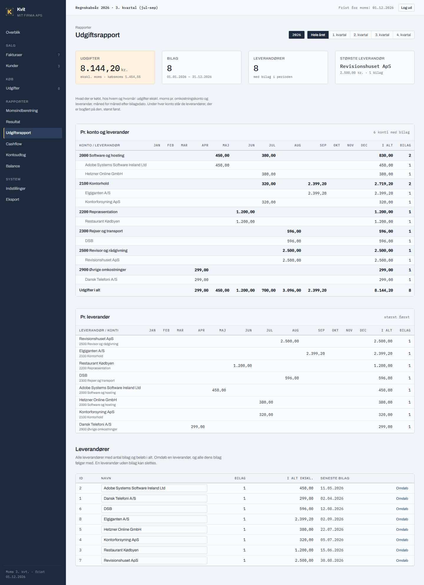

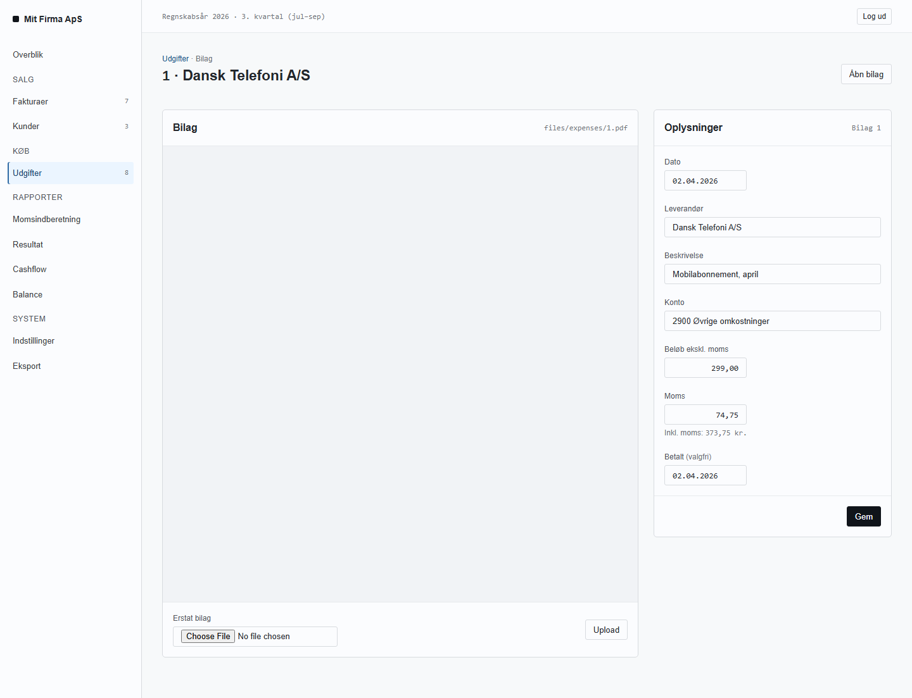

**Hvorfor tastes købsmoms manuelt?** Fordi 25 % ikke altid passer: udenlandske køb har ofte 0 % dansk moms,
repræsentation giver kun delvist fradrag, og nogle ydelser er momsfri. Programmet gætter derfor ikke – du skriver
beløbet ekskl. moms og momsbeløbet fra bilaget, og totalen regnes ud. Vælg omkostningskontoen, og sæt betalingsdato,
når regningen er betalt.

---

## 4. Moms

Den kvartalsvise rutine tager få minutter:

1. Åbn **Momsindberetning**, og vælg kvartalet. De tre tal svarer til felterne på skat.dk: **salgsmoms** (moms på
   dine udstedte fakturaer, kreditnotaer modregnes), **købsmoms** (moms på dine udgifter) og **momstilsvar**
   (forskellen). Under tallene ser du præcis de fakturaer og bilag, der ligger bag.
2. Log ind på skat.dk → TastSelv Erhverv → Moms, og indtast de to første tal. Momstilsvaret er det, du skal betale
   (eller have tilbage). Fristerne for kvartalsmoms er 1. juni, 1. september, 1. december og 1. marts; programmet
   viser den næste frist nederst i menuen.
3. Når betalingen er trukket på banken, bogfører du den på **Cashflow** som en bankbevægelse af typen *Momsbetaling*
   med beløbet som negativt tal, fx `−14.550,25`. Så falder *Skyldig moms* på balancen, og
   bankpositionen passer igen.

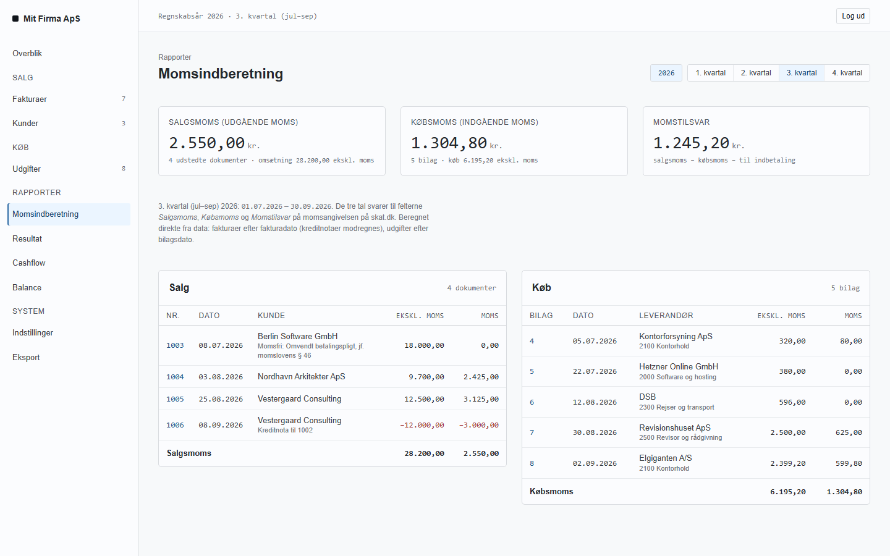

---

## 5. Månedsrutinen

**Afstemning mod banken – fem minutter.** Én gang om måneden åbner du **Balance**, slår netbanken op og indtaster den
saldo, banken viser. Er den lig med *Likvider*, er alt godt. Er der forskel, tilbyder programmet at bogføre forskellen
som en *korrektion*-bevægelse med dato og det indtastede tal i revisionssporet. Herefter stemmer bogføringen med banken.

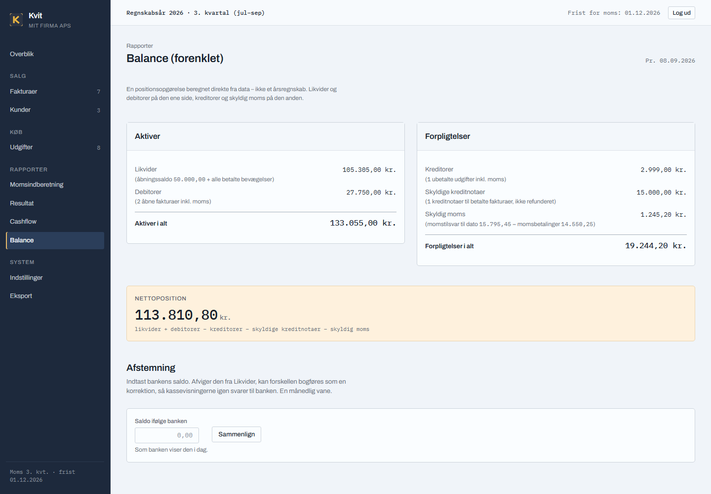

**Kontoudtog.** Under *Rapporter → Kontoudtog* står alle bankbevægelser, som programmet kender dem, i én liste:
betalte fakturaer, betalte udgifter, refunderede kreditnotaer og alle bankbevægelser (moms, skat, ejer, korrektioner,
andet) med løbende saldo. Vælg *Denne måned*, *Sidste måned*, *Dette kvartal*, *Sidste kvartal*, *I år* eller en
egen periode; primo er saldoen ved periodens begyndelse (åbningssaldoen plus alt før), ultimo saldoen ved dens
slutning. Sammenlign linje for linje med netbankens udtog, når afstemningen viser en forskel – eller hent perioden
som CSV.

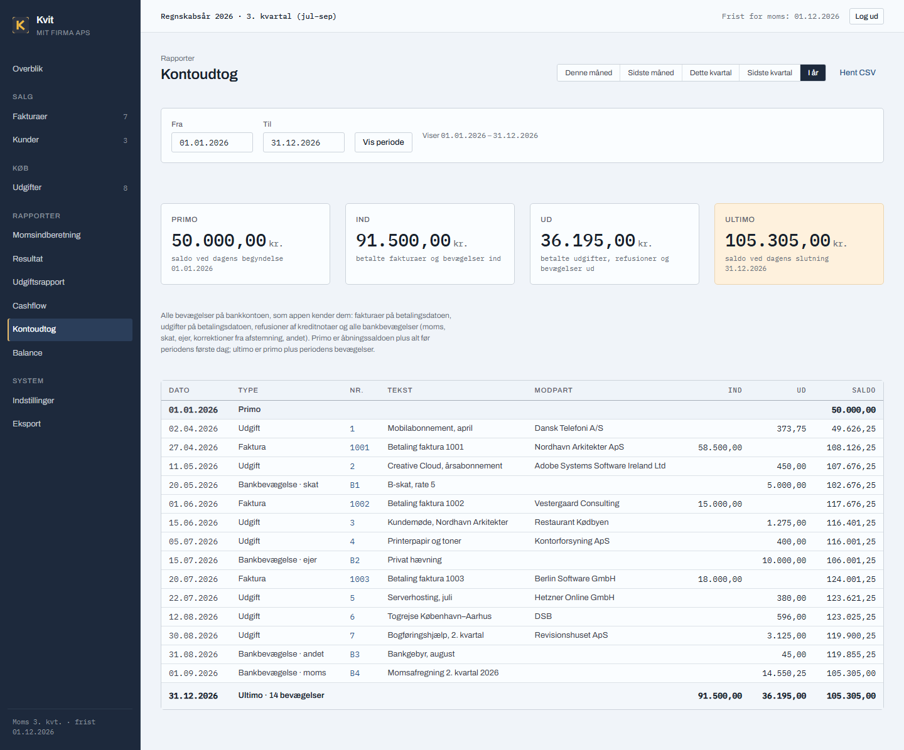

**Hvorfor det betyder noget.** Faktura har ingen bankintegration; det er en styrke (ingen adgangskoder til banken,
ingen tjeneste der kan gå ned), men det betyder, at du er den, der holder tallene ærlige. Et glemt bankgebyr eller en
privat hævning bliver til en forskel, som afstemningen fanger. Bogfør det rigtige (gebyr = *Andet*, hævning = *Ejer*)
i stedet for at lade korrektionen stå, hvis du kender årsagen. Tag samtidig et kig på **Fakturaer → Forfaldne** og
ryk kunder, der skylder.

---

## 6. Budget og overblik

**Overblik** viser det, du oftest har brug for: udestående og forfaldne fakturaer, omsætning år til dato og momsen
for det løbende kvartal – og en advarsel, hvis et udstedt dokument ikke er markeret som sendt.

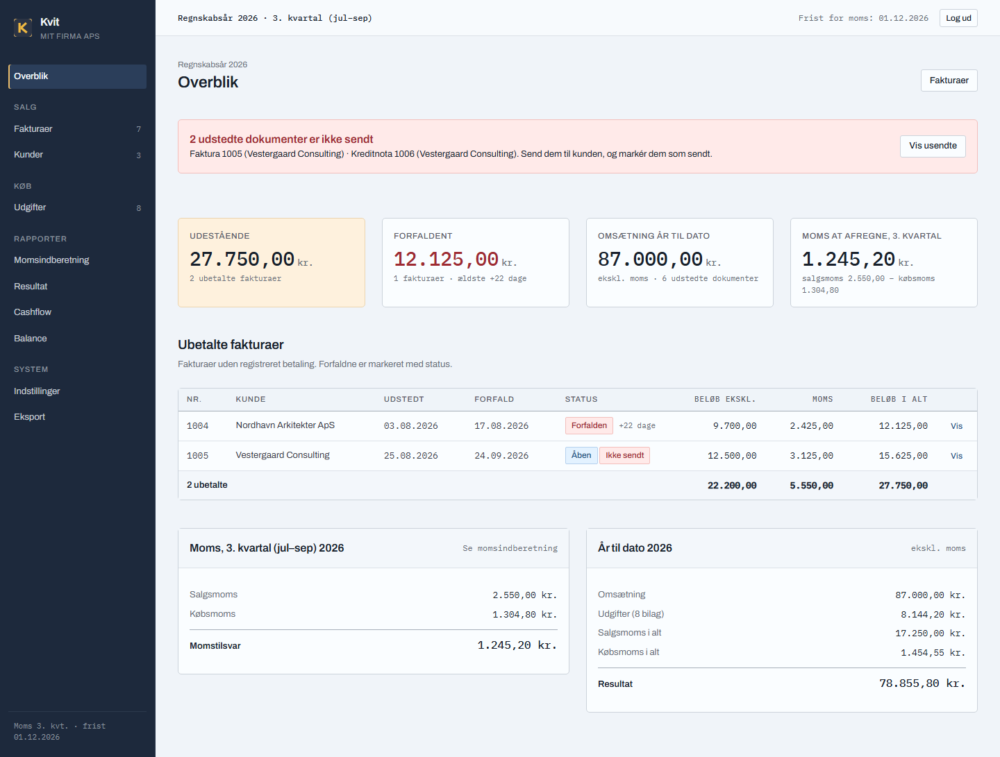

**Resultat** er et resultat før skat pr. konto for et år eller et kvartal, efter fakturadato og bilagsdato
(periodisering), ekskl. moms.

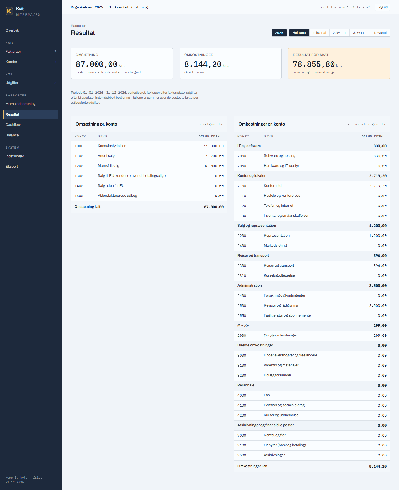

**Cashflow** viser ind, ud, netto og løbende bankposition pr. måned efter betalingsdato. Afsluttede måneder er faktiske
tal. Den igangværende måned og månederne frem er tonede og markeret *igangværende* og *prognose*: her lægger programmet
åbne fakturaer efter forfaldsmåned, ubetalte udgifter, kreditnotaer til refusion og skyldig moms efter fristen oven i.
Prognosen er en fremskrivning ud fra det, der allerede er kendt – ikke et gæt. (AI-værktøjet kalder de samme rækker
»projected«.)

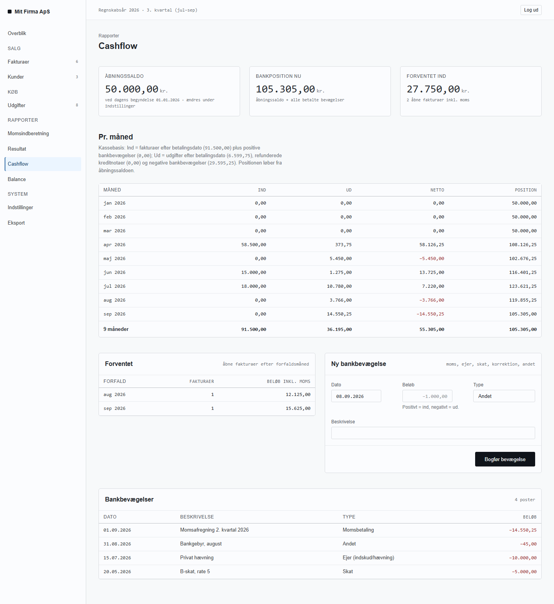

**Balance** er en forenklet stilling: Likvider og Debitorer mod Kreditorer, Skyldige kreditnotaer og Skyldig moms,
med nettopositionen nederst. Det er ikke et årsregnskab, men det tal, du står med i dag.

**Budget.** Denne version har ikke et budgetmodul. Prognosen bygger alene på kendte poster (åbne fakturaer, ubetalte
udgifter, moms). Et årsbudget pr. konto med budget- og afvigelseskolonner i Resultat er planlagt; indtil da er
Cashflow-prognosen det bedste billede af de kommende måneder.

---

## 7. AI-adgang (MCP)

**Hvad er MCP?** MCP (Model Context Protocol) er en standard, der lader en AI-assistent bruge et program gennem
veldefinerede »værktøjer«. Faktura leverer en MCP-server, så din assistent kan læse dine tal og bogføre rutineposter –
uden nogensinde at rode i databasen direkte.

**Tilslutning.** Installationen viste et konfigurationsudsnit til sidst (kør installationen igen, hvis du mistede
det; data bevares). Med Docker-installationen kører MCP-serveren ved
siden af programmet på din egen maskine, og du indsætter dette i din AI-klient (Claude Code, Claude Desktop eller
en anden MCP-klient):

```json
{ "mcpServers": { "kvit": { "type": "http", "url": "http://localhost:3333/mcp" } } }
```

Valgte du HTTPS i installationen (spørgsmålet »HTTPS: none, local eller tailscale«), står adressen i stedet som
`https://…:8443/mcp`; installationen viser den præcise adresse til sidst. Med `tailscale` kan alle enheder på dit
tailnet nå MCP-serveren, så den bør kun bruges på et tailnet, du selv styrer. Med `local` skal certifikatet
(`kvit-root-ca.crt` i installationsmappen) være betroet på maskinen; Claude Code skal startes med
`NODE_EXTRA_CA_CERTS=<mappe>/kvit-root-ca.crt`. Detaljer i hosting-vejledningen (engelsk).

Bruger du den selvstændige version (én fil), viser den ved start både et `http`-udsnit og et `command`-udsnit, hvor
programmet selv kører som MCP-server over stdio. Nøglen (API-token) ligger i konfigurationen på din maskine; klienten
behøver den ikke, når du bruger `http`-varianten på samme maskine eller over din VPN.

**Eksempler på, hvad du kan spørge om (på dansk):**

- »Hvilke fakturaer forfalder snart?«
- »Hvad står jeg i banken?«
- »Hvad skal jeg indberette i moms for 2. kvartal?«
- »Registrér min saldo: 84.250 kr« – assistenten kører afstemningen og bogfører forskellen som korrektion.
- »Bogfør bankgebyret på 45 kr fra i går.«
- »Lav en kladde til Nordhavn Arkitekter: 12 timer rådgivning à 950 kr.«
- »Opret en udgift: Hetzner, serverhosting september, 380 kr uden moms, konto 2000.«

Alt, assistenten skriver, står i revisionssporet med afsender *api* (`audit_log.csv` i eksport-zippen, se afsnit 8),
så du altid kan se, hvad der kom fra AI'en.

**Det kan AI'en ikke:**

- **udstede fakturaer** – den kan lave kladden, men *Udsted* trykker du selv i programmet,
- **oprette kreditnotaer**,
- **slette noget**.

Udstedelse og kreditering tager numre fra den lovpligtige nummerserie og er uigenkaldelige, og sletning hører ikke til
i et bogholderi; derfor er de tre handlinger bevidst umulige via MCP – ikke en manglende funktion, men selve
sikkerhedsmodellen.

---

## 8. Eksport og revisor

**Eksport-zippen.** Under **Eksport** henter du én zip med `invoices.csv`, `invoice_lines.csv`,
`invoice_attachments.csv`, `customers.csv`, `expenses.csv`, `cash_movements.csv`, `accounts.csv`, `settings.csv`,
`audit_log.csv` og `posteringer.csv` (UTF-8, semikolon, dansk decimalkomma) plus alle PDF'er og bilag. Det er pakken
til revisor: »her er alt«.

**Posteringer til revisors system.** `posteringer.csv` er en afledt kassekladde: hver faktura, betaling, udgift og
bankbevægelse står som debet og kredit mod kontoplanen og de balancekonti, du kan navngive under **Indstillinger**
(bank, debitorer, kreditorer, salgs- og købsmoms, momsafregning, skat, mellemregning med ejer, afstemning og
egenkapital som modpost til åbningssaldoen). Ret numrene, så de passer til revisors kontoplan, og revisor kan læse
kladden direkte ind i stedet for at taste. Appen fører stadig ingen balance selv – filen beregnes ved eksporten.

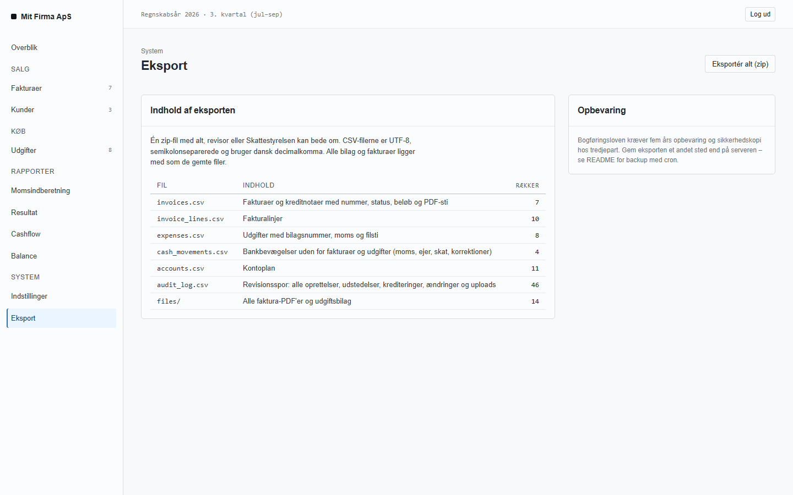

**Gendan fra eksport.** Samme zip kan læses ind igen under **Eksport → Gendan fra eksport**, fx når revisor har rettet
noget i CSV-filerne (en udgift på en anden konto, et kundenavn) eller når du vil tilbage til en ældre kopi. Programmet
kontrollerer først filen – beløb skal passe til linjerne, fakturanumre må ikke gentages, konti og kunder skal findes –
og viser en opsummering med antal i zippen mod antal i appen. Først når du sætter kryds og bekræfter, erstattes alle
data, og inden da kopieres de nuværende data til `data/backups/data.bak01/` (næste gang `data.bak02/` osv.) med
databasen, alle filer og den indlæste zip. Udstedte fakturaer kan ikke ændres i appen, men rettes de i CSV'en, skal
beløbene stadig stemme med linjerne, ellers afvises filen. Gendannelse findes bevidst ikke som MCP-værktøj.

**Fem års opbevaring.** Bogføringsloven kræver, at regnskabsmaterialet gemmes i fem år, og at der findes en
sikkerhedskopi hos en tredjepart (et andet sted end på din egen maskine). Se hosting-vejledningen
(<https://github.com/kvit-app/faktura/blob/main/HOSTING.md>) for et natligt backup-eksempel; en backup er ganske enkelt en kopi af datamappen.

**Hvor alt ligger på disken.** Alt persistent ligger i datamappen (`data/` under den mappe, du valgte ved installationen):

| Sti | Indhold |
|---|---|
| `data/app.db` | Databasen (SQLite) – kunder, fakturaer, udgifter, bevægelser, indstillinger, revisionsspor |
| `data/files/invoices/<nummer>.pdf` | De udstedte fakturaer og kreditnotaer – de juridiske dokumenter |
| `data/files/invoices/bilag/` | PDF-bilag vedhæftet fakturaer |
| `data/files/expenses/<bilagsnr>.<type>` | Uploadede udgiftsbilag |
| `data/backups/` | Automatiske kopier af databasen fra før hver opdatering, og `data.bakNN/` med alt fra før hver gendannelse |

Kopiér mappen, og du har hele bogholderiet.
